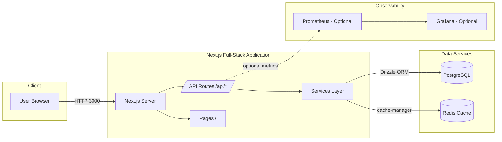

# Architecture

This is a full-stack Next.js application with all backend functionality integrated as API routes. Persistence is handled by PostgreSQL via Drizzle ORM, with Redis for caching/rate limiting.

- Application root: `global-classifieds-marketplace`
- Framework: Next.js 15 (App Router)
- Ops: `ops/` (Prometheus and OTEL collector configs, optional)

## High-Level Diagram (Mermaid)

## Request Flow
1. Browser sends requests to Next.js (port 3000).
2. Client-side code uses `src/lib/http.ts`, which prefixes requests with `/api`.
3. Next.js API routes (`src/app/api/*/route.ts`) handle requests directly.
4. API routes use services from `src/lib/services/` for business logic.
5. Services interact with PostgreSQL via Drizzle ORM and Redis for caching.
6. Responses are returned directly from API routes.
7. Optional metrics can be exposed at `/api/metrics` for Prometheus.

## Application Architecture Notes
- **API Routes**: All backend functionality is in `src/app/api/` using Next.js Route Handlers
- **Services**: Business logic is separated into service classes in `src/lib/services/`
- **Database**: Drizzle ORM with PostgreSQL for type-safe database operations
- **Caching**: Redis-based caching for listings and rate limiting
- **Authentication**: JWT-based auth with refresh tokens, account lockout, and audit logging
- **Security**: Rate limiting via middleware, security headers, and comprehensive audit trails

## Key Components

### API Routes (`src/app/api/`)
- `/api/auth/*` – Authentication endpoints (login, register, refresh, logout)
- `/api/listings/*` – Listings CRUD operations
- `/api/health` – Health check endpoint

### Services (`src/lib/services/`)
- `AuthService` – Handles authentication, account lockout, token management
- `UsersService` – User CRUD operations
- `ListingsService` – Listings operations with caching
- `PasswordService` – Argon2 password hashing with bcrypt migration
- `RefreshTokenService` – Refresh token management
- `AuditService` – Security audit logging

### Database (`src/db/`)
- `schema.ts` – Drizzle ORM schema definitions
- Database connection managed via `src/lib/db.ts`

### Middleware (`middleware.ts`)
- Rate limiting for API routes
- Content Security Policy (CSP) headers
- Authentication guards for protected routes
