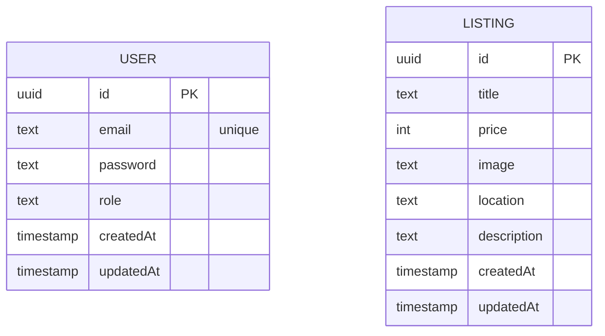

# Database Documentation

This project uses PostgreSQL 16 with TypeORM 0.3.x. Entities are defined in the backend (`apps/backend/src/**/**.entity.ts`). Redis is used for caching and rate limiting counters (via `cache-manager-redis-store`).

- DB: PostgreSQL 16 (container `postgres:16-alpine` in compose)
- ORM: TypeORM 0.3.x
- Entities: `User`, `Listing`
- Migrations configured via `apps/backend/ormconfig.ts`

## Connection and Configuration
TypeORM connection is created in `apps/backend/src/app.module.ts` via `TypeOrmModule.forRootAsync` with env-driven config:
- `DATABASE_URL` (postgres URI) or discrete envs `DATABASE_HOST`, `DATABASE_PORT`, `POSTGRES_USER`, `POSTGRES_PASSWORD`, `POSTGRES_DB`.
- Synchronize is disabled by default; only enabled in non-production if `TYPEORM_SYNCHRONIZE=true`.

Example envs (see `.env.development`):
```
DATABASE_URL=postgresql://user:password@db:5432/classifieds_db
POSTGRES_USER=user
POSTGRES_PASSWORD=password
POSTGRES_DB=classifieds_db
TYPEORM_SYNCHRONIZE=true   # development only
```

Security considerations:
- Use strong, unique DB password in production.
- Disable `TYPEORM_SYNCHRONIZE` in production and run migrations.
- Do not expose Postgres port publicly in staging/production.

## Schema Overview
Entities in `apps/backend/src/users/user.entity.ts` and `apps/backend/src/listings/listing.entity.ts`:

- `User`
  - `id` uuid PK
  - `email` unique text
  - `password` text (excluded from serialization)
  - `role` text default `user`
  - `createdAt` timestamp default now
  - `updatedAt` timestamp default now, on update now

- `Listing`
  - `id` uuid PK
  - `title` text
  - `price` int
  - `image` text nullable
  - `location` text nullable
  - `description` text nullable
  - `createdAt` timestamp default now
  - `updatedAt` timestamp default now, on update now

Note: No explicit relations currently exist between `User` and `Listing`. Consider adding ownership relation (e.g., `listing.ownerId -> user.id`).

## ER Diagram (Mermaid)


## Example SQL DDL (Conceptual)
```sql
CREATE TABLE users (
  id UUID PRIMARY KEY DEFAULT gen_random_uuid(),
  email TEXT UNIQUE NOT NULL,
  password TEXT NOT NULL,
  role TEXT NOT NULL DEFAULT 'user',
  created_at TIMESTAMPTZ NOT NULL DEFAULT now(),
  updated_at TIMESTAMPTZ NOT NULL DEFAULT now()
);

CREATE TABLE listings (
  id UUID PRIMARY KEY DEFAULT gen_random_uuid(),
  title TEXT NOT NULL,
  price INTEGER NOT NULL,
  image TEXT,
  location TEXT,
  description TEXT,
  created_at TIMESTAMPTZ NOT NULL DEFAULT now(),
  updated_at TIMESTAMPTZ NOT NULL DEFAULT now()
);
```

## Migrations
- DataSource: `apps/backend/ormconfig.ts` (exports `AppDataSource`).
- Scripts (from `apps/backend/package.json`):
  - `pnpm --filter backend migration:generate` – generate migration from entity changes.
  - `pnpm --filter backend migration:run` – apply migrations.
  - `pnpm --filter backend migration:revert` – rollback last migration.

Ensure `NODE_ENV`, `DATABASE_*` envs are set when running CLI. `ormconfig.ts` loads envs via `dotenv`.

## Redis Usage
- Rate limiting counters: `rl:*` keys (see `apps/backend/src/common/guards/rate-limit.guard.ts`).
- Auth lockout/backoff keys in `AuthService`: `auth:fail:<email>`, `auth:lock:<email>`.
- Configured through Nest CacheModule with `cache-manager-redis-store` in `app.module.ts`.

## Stored Procedures / Triggers
- None implemented in the current codebase.

## Backups and Maintenance
- Use volume `db_data` (compose) for persistence.
- Implement regular backups for production (outside scope of this repo).
